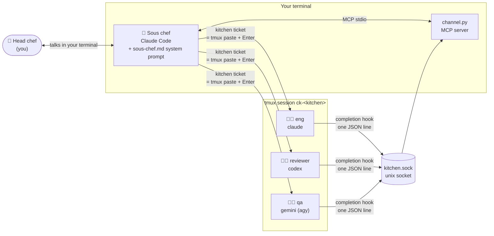
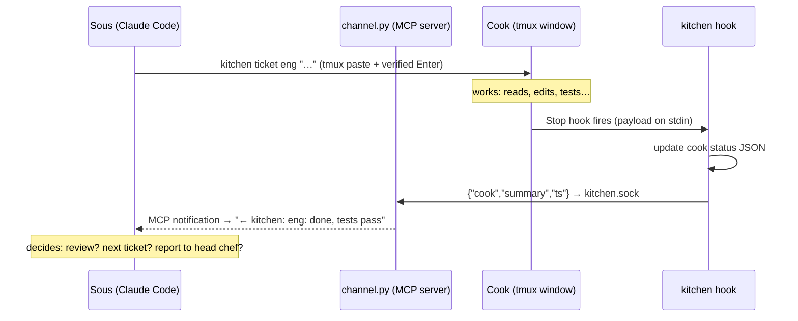

# How kitchen works

Kitchen turns one Claude Code session into a manager of many coding agents — without a single API key.

The trick: every agent CLI (Claude Code, Codex, Gemini) is already a complete interactive app. Kitchen doesn't reimplement them against an API — it runs the **stock CLIs in tmux windows**, types into them the way a human would, and listens for "I'm done" through each CLI's own hook system. Because the cooks are just the normal CLIs authenticated the normal way, everything runs on your **existing subscriptions** (Claude Pro/Max, ChatGPT, Gemini) instead of metered API billing.

## The picture



Two independent channels, one per direction:

- **Downstream (sous → cook): keystrokes.** `kitchen ticket eng "fix the auth bug"` pastes the message into the cook's tmux pane and presses Enter. The cook can't tell it apart from a human typing.
- **Upstream (cook → sous): hooks.** When a cook finishes a turn, its CLI's native hook (Claude's `Stop` hook, Codex's `notify`, agy's stop hook) runs `kitchen hook`, which sends one JSON line (`{cook, summary, ts}`) to a per-kitchen unix socket. A tiny MCP server forwards it into the sous's context as a channel notification: `← kitchen: <cook's last message>`. The sous reads it and decides what's next — no polling, no scraping.

## The cast

| Role | What it is |
|---|---|
| **Head chef** | You. Talk to the sous in natural language; give goals, not commands. |
| **Sous chef** | Claude Code running in your terminal, with `sous-chef.md` appended to its system prompt. It hires cooks, writes tickets, reviews results, and iterates. Its prompt forbids it from reading source or running tests itself — its context is reserved for coordination; cooks burn theirs instead. |
| **Cooks** | Stock agent CLIs, one per tmux window. Optionally given a role prompt (`eng`, `qa`, `reviewer`) at hire time. `tmux -L ck-<kitchen> attach` and watch any of them live — or grab the keyboard and take over. |

## Upstream in detail: hook → socket → MCP channel

This is the part that uses Claude Code's **channels** feature (`--dangerously-load-development-channels`, CLI ≥ 2.1.80, claude.ai web auth — channels aren't exposed to API-key logins).



The moving parts:

1. **`kitchen open`** writes a per-kitchen MCP config (`{"kitchen": {"command": "kitchen", "args": ["channel-server", "<name>"]}}`) and launches the sous as `claude --dangerously-load-development-channels server:kitchen --mcp-config … --append-system-prompt <sous-chef.md>`.
2. Claude Code spawns **`channel.py`** as a normal stdio MCP server. Besides speaking MCP, it listens on `~/.claude-kitchen/<kitchen>/kitchen.sock`.
3. Each JSON line arriving on the socket becomes a `notifications/claude/channel` JSON-RPC notification on the MCP stream. Claude Code renders it into the sous's context. That's the entire server — ~180 lines.
4. **Hooks are installed globally but gated by environment.** Every cook window exports `AGENT_NAME`, `AGENT_KITCHEN`, `STATUS_DIR`. The hook exits silently when they're unset (your ad-hoc `claude` sessions are untouched) and is a no-op for `AGENT_NAME=sous` (otherwise the sous's own Stop events would echo back into its own channel — a feedback loop).

## Downstream in detail: typing into a TUI, reliably

Sending text to an interactive TUI is the genuinely fiddly part. `tmux send-keys` alone loses races: long pastes render placeholder stubs while bytes are still streaming, Codex sometimes swallows the first Enter after a paste, and pressing Enter blind into a half-rendered composer submits garbage. Kitchen's `send_keys` (in `tmux.py`) hardens this into a verified pipeline:

1. **Bracketed paste from a named tmux buffer** — newlines stay newlines instead of triggering submit; named buffers keep concurrent sends to different cooks from clobbering each other.
2. **Settle-poll** — wait until the pane shows evidence the paste landed (a `[Pasted N lines]` stub or the payload's first line) *and* stops repainting for ~150 ms.
3. **Verified submit** — capture the cursor column of the *empty* composer before pasting; after Enter, the cursor snapping back to that column is positive proof the input was accepted. Retry Enter (never re-paste) up to 8 times.
4. **Fail loudly** — if the paste never settles or never submits, raise. No silent lost tickets.

Two more pane-reading primitives make orchestration possible:

- **`wait_for_prompt`** — after spawning a cook, watch the pane for the backend's welcome banner (`Claude Code v`, `OpenAI Codex (v`, …) before sending anything, auto-dismissing first-run dialogs on the way. Progress-based: keeps waiting while the pane is still changing, gives up only when it freezes.
- **`pane_busy`** — is the cook mid-turn? Each backend has an empirically-verified busy marker (Claude's spinner glyph + `…` ellipsis, Codex's `esc to interrupt` footer, agy's `esc to cancel`). Used to avoid interrupting a cook that's still working.

## Any CLI can be a cook

The cook abstraction is deliberately thin. A backend is just five facts:

| | Claude | Codex | Gemini (agy) |
|---|---|---|---|
| **Launch** | `claude --dangerously-skip-permissions` | `codex --dangerously-bypass-approvals-and-sandbox` | `agy --dangerously-skip-permissions` |
| **Role prompt delivery** | `--append-system-prompt-file` at launch | first message via `send_keys` after boot (no system-prompt flag) | inlined as first turn via `-i` |
| **Ready marker** | `Claude Code v` banner | `OpenAI Codex (v` banner | `? for shortcuts` footer |
| **Busy marker** | spinner glyph + `…` | `esc to interrupt` | `esc to cancel` |
| **Completion hook** | `Stop` hook in `~/.claude/settings.json` → `kitchen hook` | `notify = ["kitchen","hook-codex"]` (forced per-launch via `-c`) | agy stop hook → `kitchen hook-agy` |
| **Effort mapping** | `low/medium/high/max` | same, `max` → `xhigh` | n/a |

To add a new backend you supply exactly that row: a launch command, two pane markers, a way to deliver the role prompt, and some hook/callback the CLI fires on turn completion that can run `kitchen hook-<backend>`. Everything else (spawn, ticket, peek, brigade, channel) is backend-agnostic.

## Why tmux instead of the API?

- **Subscription auth.** Cooks are the ordinary CLIs logged in the ordinary way. A ten-cook brigade costs the same as your existing plans.
- **Total observability.** `tmux -L ck-<kitchen> attach` shows every cook's live screen (the kitchen's server holds one session, so no `-t` is needed; windows are `kitchen:<cook>`). `kitchen peek <cook>` captures a pane snapshot for the sous. If a cook goes sideways, you type into its window directly.
- **Full-fidelity agents.** Each cook gets the complete product — plugins, skills, MCP servers, its own permission mode — not a stripped-down API harness.
- **Isolation.** A crashed cook is a dead tmux window, not a corrupted orchestrator. The sous notices (no completion arrives, `pane_busy` false) and re-hires. Each kitchen also gets its own single-threaded tmux server (`-L ck-<kitchen>`), so a kitchen that saturates its server can't starve the others.

## State on disk

```
~/.claude-kitchen/
├── <kitchen-name>/            # per-kitchen, wiped on `kitchen close`
│   ├── kitchen.json           #   project path, slug, worktree, sous session id
│   ├── kitchen-mcp.json       #   MCP config the sous launches with
│   ├── kitchen.sock           #   the unix socket (exists while channel server runs)
│   ├── sous.pid               #   duplicate-sous guard
│   ├── cooks/<name>.json      #   per-cook status: backend, working/idle, last summary, tokens
│   └── notes/                 #   sous scratch: handoff.md, log.md, task briefs
└── projects/<slug>/wiki/      # per-project, survives kitchens: mistakes.md, preferences.md
```

Cook status JSON doubles as the data source for `kitchen brigade` (fleet status) and the sous's statusline.

## Build it yourself

The whole system is ~2,500 lines of Python across five files. The minimal recipe:

1. **A tmux layer** — spawn windows running agent CLIs with env vars baked into the shell command; `capture-pane` to read screens; the verified paste-and-submit loop above to write to them. This is where the real engineering lives.
2. **A completion callback per backend** — any "turn ended" hook the CLI offers, invoking a small script with the agent's name in its environment.
3. **A message bus back to the orchestrator** — kitchen uses a unix socket + Claude Code's MCP channel notifications, which land messages *in the orchestrator's context* mid-session. (Fallback if you can't use channels: have the orchestrator poll the status files.)
4. **An orchestrator prompt** — a system-prompt appendix that teaches the manager agent the CLI verbs (`hire`, `ticket`, `peek`, `brigade`, `clock-out`) and one iron rule: *delegate everything; your context is for coordination, not content.*
5. **State files** — one JSON per cook, one dir per kitchen. No database, no daemon beyond the MCP server.
